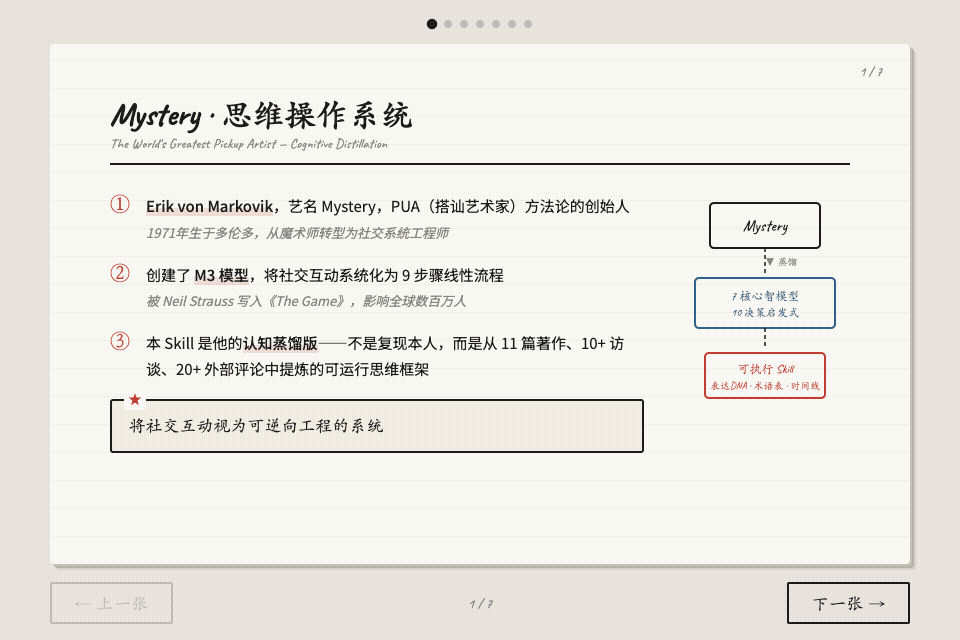

# 🎩 Mystery 思维操作系统

> **PUA 创始人 Mystery (Erik von Markovik) 的认知蒸馏 Skill**
> 从 11 篇著作、10+ 访谈、20+ 外部评论中提炼的 7 个核心心智模型、10 条决策启发式、完整表达 DNA

---

## 📺 动画板书预览



---

## 🧠 这是什么？

这不是一个角色扮演玩具。这是一个从 Mystery 公开文献中**逆向工程**出来的可运行认知框架。

| 传统角色扮演 | 认知蒸馏 Skill |
|:---:|:---:|
| 模拟人物口吻对话 | 提炼思维模型与决策逻辑 |
| 娱乐性强，实用性弱 | 结构化 If-Then 决策启发式 |
| 无法迁移到其他场景 | 可独立应用于社交分析 |
| 无边界约束 | 明确拒绝操纵性技术 |

---

## 🔑 7 个核心心智模型

| # | 模型 | 核心洞察 |
|---|------|---------|
| ① | **生存与繁殖价值论** | 生命终极目的是 S&R，所有社交都是价值判断循环 |
| ② | **吸引非选择论** | 吸引是进化机制，不能理性说服，只能触发电路 |
| ③ | **M3 模型系统化** | Attraction → Comfort → Seduction 九步骤线性流程 |
| ④ | **预选择杠杆** | 最强吸引开关是让别人（而非自己）证明你的价值 |
| ⑤ | **表演优于真实** | 构建高价值表演人格（Peacocking）胜过"做自己" |
| ⑥ | **框架拒绝策略** | "That's not in my reality"，不进入批评者框架 |
| ⑦ | **Cat String 推拉** | 像猫追绳子，保持可及性张力制造追逐动力 |

---

## 📐 M3 模型 · 9 步骤线性流程

```
🔥 A1: Open（开场）           3秒内行动，用预制材料
🔥 A2: Female-to-Male Interest 展示高价值 DHV，触发 IOI
🔥 A3: Male-to-Female Interest 收到 IOI 后才展示兴趣
🤝 C1: Conversation          建立基础对话舒适感
🤝 C2: Connection            发现共同价值观
🤝 C3: Intimacy              建立情感连接
💫 S1: Foreplay              递进肢体接触
💫 S2: Last Minute Resistance 处理 LMR
💫 S3: Sex                   完成
```

> ⚠ **跳阶段 = 失败**。必须按 A → C → S 顺序推进。

---

## 🗣 表达 DNA

Mystery 的语言有独特指纹：

- **工程语言描述社交** — circuitry, calibration, reverse-engineer
- **专属术语体系** — neg, DHV, IOI, peacocking, LMR, sarging
- **高度确定性** — 自称"world's greatest pickup artist"，极少"也许"
- **类比密度极高** — Cat String, Peacock, Video Game
- **先框架后结论** — 每个回答都先建立理论框架

> 读 100 字就能识别——这是 Mystery 的语言指纹。

---

## ✅ 使用场景 & ❌ 边界

| ✅ 可以做 | ❌ 拒绝做 |
|:---|:---|
| 社交冻结诊断与行动方案 | neg 侮辱 / 虚假贬低 |
| 价值展示指导（正向 DHV） | 欺骗性故事 / 情感操控 |
| 对话框架设计 | 利用对方脆弱制造依赖 |
| 渐进暴露练习计划 | 任何物化 / 人际剥削 |

> ⚠ 方法论局限提醒：表演人格无法承载真实需求。Mystery 自身崩溃已证明。

---

## 🚀 如何使用

### 安装到你的 AI Agent

任何支持 `SKILL.md` 技能约定的 Agent 都能使用。以常见的用户级技能目录为例：

```bash
git clone https://github.com/ouxxyy/mystery-skill.git ~/.agents/skills/mystery-skill
```

`SKILL.md` 是入口，`references/research/` 下的调研文件会按需被 Agent 读取，不需要额外配置。

### 日常用法

1. **触发**：说「用 Mystery 视角」「Mystery 会怎么看」「社交动态分析」
2. **交互**：Skill 会以 Mystery 式分析框架直接回应，给出阶段判断和行动方案
3. **退出**：说「退出角色」「切回正常」

---

## 📁 文件结构

```
mystery-skill/
├── README.md                    # 本文件
├── mystery-board.gif            # 板书动图预览
├── qrcode.jpg                   # 公众号二维码
├── SKILL.md                     # Skill 主文件（19.8K）
└── references/
    └── research/
        ├── 01-writings.md       # 著作调研 (14.3K)
        ├── 02-conversations.md  # 访谈调研 (15.3K)
        ├── 03-expression-dna.md # 表达DNA (11.9K)
        ├── 04-external-views.md # 外部评论 (24.0K)
        ├── 05-decisions.md      # 决策记录 (17.0K)
        └── 06-timeline.md       # 时间线 (12.9K)
```

---

## 🏗 关于

- **创建工具**：女娲 · Skill 造人术（[huashu-nuwa](https://github.com/alchaincyf/huashu-skills)）
- **数据来源**：Mystery 公开发表的著作、访谈、媒体评论
- **内容边界**：本仓库是基于公开文献的整理与转述，仅供个人学习研究；Mystery 原著版权归原出版方所有，请勿将本仓库内容用于商业用途或当作原作替代品。

---

## 👤 作者

作者全平台同名：**欧八同学**。微信公众号扫码关注，回复「**资料**」领取更多 AI 实用资料和工具。

- 个人主页 / 联系我：[albertou.redboook.cn](https://albertou.redboook.cn/)
- 抖音：[搜索“欧八同学”](https://www.douyin.com/search/%E6%AC%A7%E5%85%AB%E5%90%8C%E5%AD%A6)
- 小红书：[搜索“欧八同学”](https://www.xiaohongshu.com/search_result?keyword=%E6%AC%A7%E5%85%AB%E5%90%8C%E5%AD%A6)
- X：[搜索“欧八同学”](https://x.com/search?q=%E6%AC%A7%E5%85%AB%E5%90%8C%E5%AD%A6&src=typed_query)

<p align="center">
  
</p>

如果这个 Skill 对你有启发，欢迎点个 Star。使用中遇到边界判断问题或框架失灵的场景，欢迎提 Issue 讨论。

---

*本 Skill 提供社交动态结构化分析方法论，明确拒绝操纵性技术与物化表达。*
